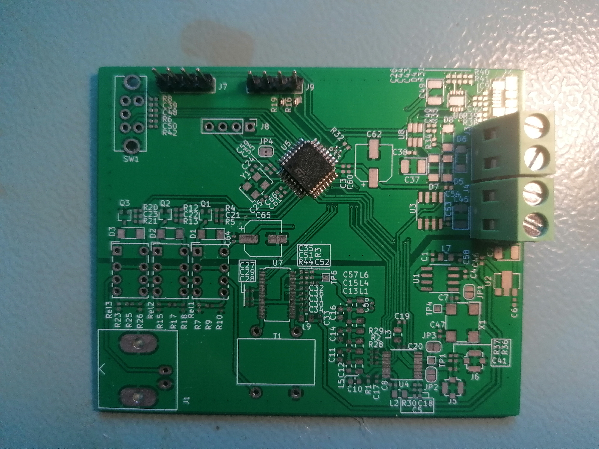

# 6MHz DDS Function Generator

**This project is unfinished.**

 

## Summary

A function generator is a laboratory instrument used to generate various electrical waveforms. This project utilizes DDS  [DDS (direct digital synthesis)](https://en.wikipedia.org/wiki/Direct_digital_synthesis), a technique that allows the creation of arbitrary waveforms from a single base frequency.

## Current Version

The current version of the PCB uses components with 0402 (or similar) footprints. Use of these components wasn’t the best choice - they're too difficult to solder, and there was no need to minimize the board size. The next version of the PCB will switch to 0805 components for easier assembly.

## System Architecture

Tools: PlantUML

## Hardware

Tools: KiCad (for PCB design).

## Software

Tools:
* **Business Logic:** Written in Forth, a stack-based programming language designed for embedded systems and control applications.
* **Drivers:** Developed in C++17.
* **Hardware Abstraction Layer (HAL):** Auto-generated using CubeMX, a tool from STMicroelectronics.

## Simulation

This project includes an LCD for user interaction. To simplify the creation of the layout, a simulation environment has been developed. 

This simulation combines the following:
* **UI:** Built using PyQt for rendering the LCD layout and facilitating user interaction.
* **Business Logic:** Reuses the core firmware logic directly from the hardware codebase.
* HAL and Driver Mocks: Created in C++.

[More Info](./Simulation/FirmwarePCSimulator/README.md)

## Enclosure

The device's enclosure is designed using **OpenSCAD**, a script-based 3D CAD modeler that allows precise and parametric design.

[More Info](./Mechanic/MechanicOverview/README.md)

## Devops

Repetitive setup tasks are best left to automation, which is why the development environment is managed with Docker. This approach eliminates the need to deal with outdated installation lists or READMEs—just run the container, and everything is ready to go.