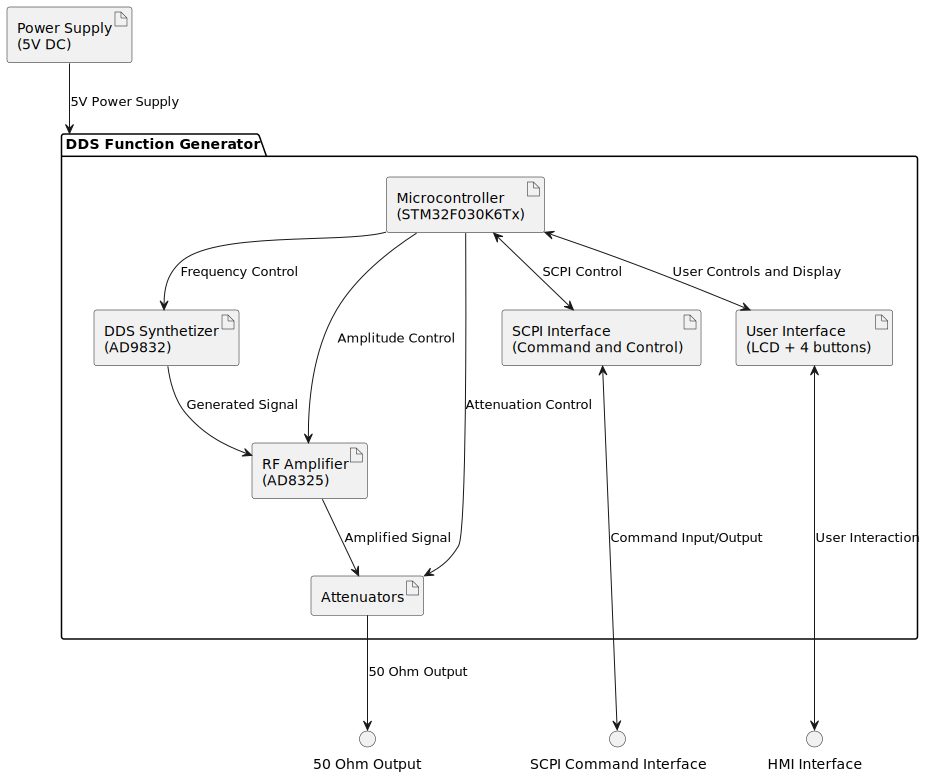

# 6MHz DDS Function Generator

 

**This project is unfinished.**

## Summary

Function generator is a laboratory device to generate various electric waveforms. [DDS (direct digital synthesis)](https://en.wikipedia.org/wiki/Direct_digital_synthesis) is a method to create arbitrary waveforms from one base frequency.

## System architecture

## Hardware

Hardware was done using KiCAD.

## Software

Business logic will be implemented in Forth. HAL was generated in C using CubeMX.
